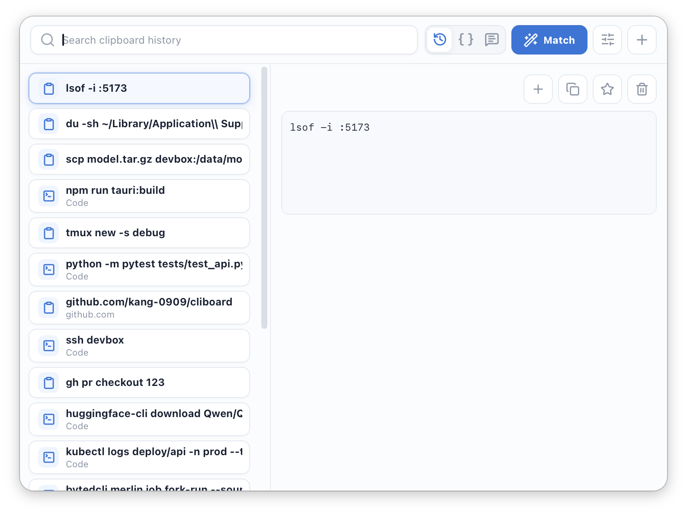
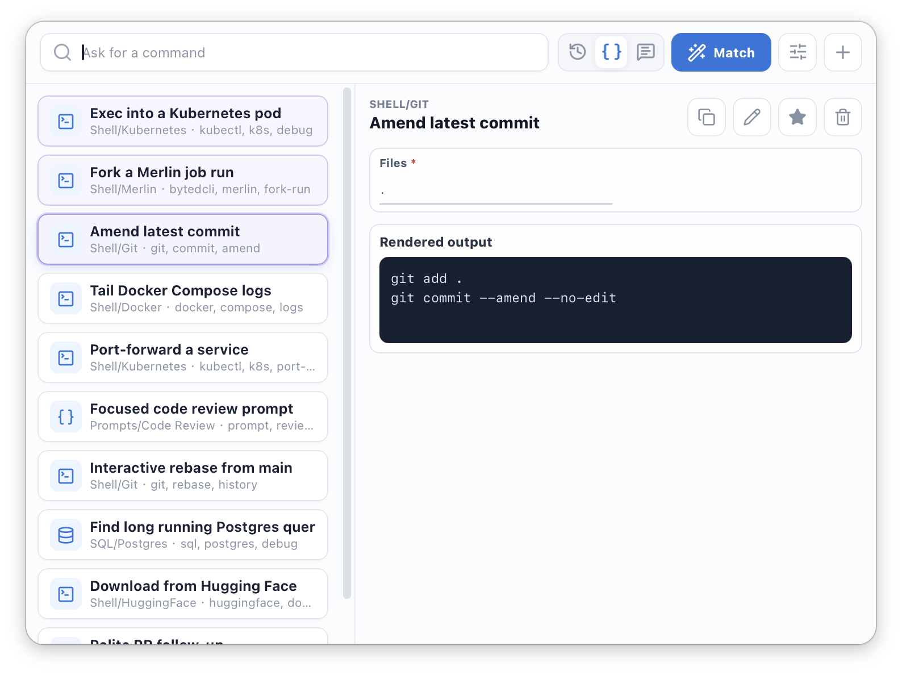
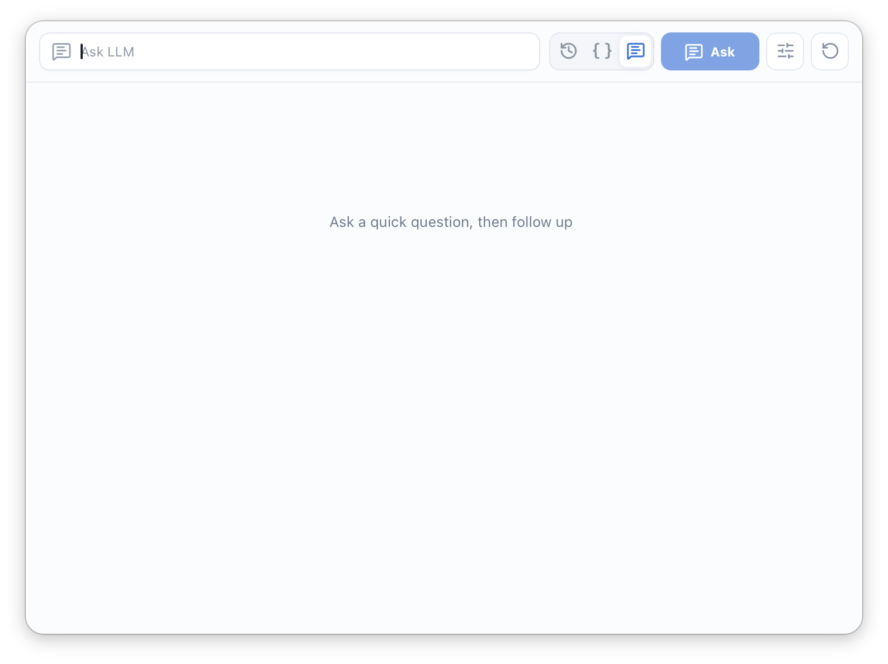

<p align="center">
  
</p>

# Cliboard

*A smart clipboard for CLI commands.*

[English README](README.md)

**CLI 命令太多，记不住很正常。** 真正麻烦的也不只是记忆本身，而是同一条命令经常要在本地 shell、远程机器、集群、模型下载和部署工具之间来回用：这次换 job id，下次换模型名，再下次又要多加一个参数。

Cliboard 是一个键盘优先的命令剪切板。你可以把常用命令、提示词、URL、文件、图片和笔记放进去，需要时用关键词或自然语言搜出来。它会尽量匹配合适的条目，帮你改参数、补缺省值，然后回车粘贴回当前应用。

## 快速开始

从 [GitHub Releases](https://github.com/kang-0909/cliboard/releases/latest)
下载最新版本。ZIP 压缩包提供直接下载的应用；DMG 提供标准的拖拽安装方式。

第一次使用自动粘贴时，macOS 可能会要求授予辅助功能权限。
macOS 可能还需要在首次启动前到“系统设置 > 隐私与安全”中选择“仍要打开”。

默认快捷键：

- **`Shift + Cmd + V`**：打开剪切板历史
- **`Shift + Option + Cmd + V`**：打开智能 snippets
- **`Option + Space`**：打开 Ask
- `Esc`：隐藏面板
- `Enter`：复制或粘贴选中条目

Cliboard 是无 Dock 图标的面板应用。需要退出时，打开 Settings，点击 `Quit Cliboard`。

## 截图



搜索最近复制过的文本、文件、URL 和命令，然后直接粘贴回原来的应用。



保存可复用的命令片段，填入参数，直接生成最终命令。



在键盘优先的小面板里快速提问，不用切走当前工作流。

## 你可以做什么

- **搜索剪切板历史**，并重新粘贴之前复制过的文本、URL、文件和图片。
- **把常用命令和提示词保存成 snippets**，并用参数快速改值。
- 从剪切板条目一键转成 snippet，再调整标题、路径、标签和模板。
- 使用过滤器搜索，例如 `type:image`、`app:chrome`、`path:Shell/HuggingFace`、`starred`、`today`。
- 保存复制过的文件和图片，之后可以再次粘贴原始内容。
- 用 **Ask 面板**解释命令、起草回复、整理笔记，支持 Markdown 和数学公式。

## 智能 Snippet 示例

先保存一次：

```bash
curl https://api.openai.com/v1/chat/completions \
  -H "Authorization: Bearer $OPENAI_API_KEY" \
  -H "Content-Type: application/json" \
  -d '{
    "model": "gpt-4.1-mini",
    "messages": [{"role": "user", "content": "Reply with only OK."}],
    "temperature": 0.2,
    "top_p": 0.9,
    "max_tokens": 128,
    "stream": false
  }'
```

之后输入：

```text
向 v4flash 发送请求，给我讲个笑话，开启思考。
```

Cliboard 生成：

```bash
curl https://api.deepseek.com/v1/chat/completions \
  -H "Authorization: Bearer $DEEPSEEK_API_KEY" \
  -H "Content-Type: application/json" \
  -d '{
    "model": "deepseek-v4-flash",
    "messages": [{"role": "user", "content": "给我讲个笑话。"}],
    "temperature": 0.2,
    "top_p": 0.9,
    "max_tokens": 128,
    "stream": false,
    "thinking": {"type": "enabled"}
  }'
```

它先匹配到保存过的 curl snippet，然后修改 provider URL、API key 环境变量、
model、prompt 和 thinking mode，并保留没有提到的 `temperature`、`top_p`、
`max_tokens`、`stream` 等设置。

## LLM 设置

**LLM 是可选功能。** 没有 API key 时，剪切板历史、snippets、过滤器和本地搜索仍然可以正常使用。LLM Match 默认关闭，所以按 Match 会先走本地搜索，除非你主动开启。

智能匹配推荐默认使用 **DeepSeek v4 flash**：速度比较适合命令查找和参数改写，API 成本也低。

如需开启 LLM，进入 Settings，打开 LLM，选择 provider 预设或自定义 OpenAI-compatible endpoint，然后填写你自己的 API key。

**项目不会内置 API key。** 请不要提交 `.env` 或任何包含密钥的本地配置文件。

## 构建和测试

```bash
npm install
npm run tauri:dev
npm run build
npm test
npm run tauri:build
```

Cliboard 仍然是 early preview，但剪切板、snippet、智能匹配和 Ask 主流程已经可用。
